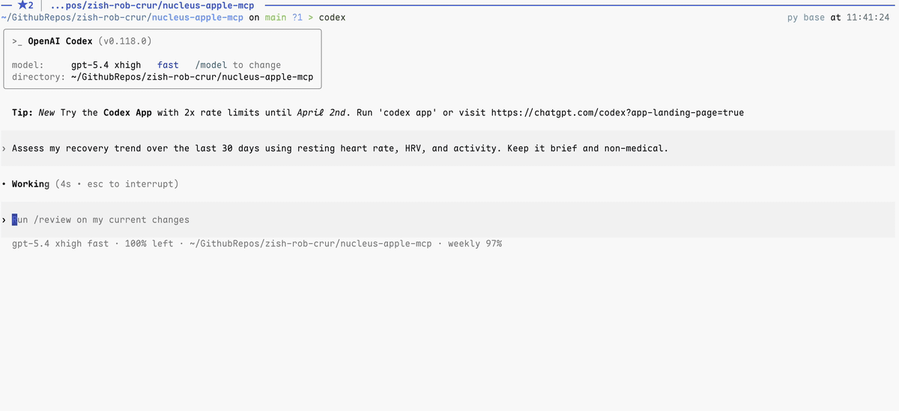

[English](README.md)

# ⚛️ Nucleus：macOS 生活上下文服务器

**为你的 AI 智能体赋予海马体。**

`nucleus-apple-mcp` 是一个基于模型上下文协议（MCP）的服务器，旨在统一你在 macOS 上的数字生活。它允许 AI 智能体（如 Claude Desktop、Cursor 或自定义智能体）安全地读取并与你的个人数据生态系统进行交互。

与脆弱的 PyObjC 桥接方案不同，**Nucleus** 采用混合架构：一个 Python MCP 服务器负责编排轻量级的、即时编译的原生 Swift 工作进程。这确保了对 Apple 原生 API 的类型安全、高性能且可靠的访问，同时仍可通过 `uvx` 轻松分发。

产品概览与配置说明，请参阅 [docs/introducing-nucleus.md](docs/introducing-nucleus.md)。
从 App Store 下载 iOS 应用：[Nucleus Context Hub](https://apps.apple.com/us/app/nucleus-context-hub/id6760659033)。

<p align="center">
  
</p>

<p align="center">
  <em>终端 + MCP 演示：Nucleus 对导出的健康数据进行 30 天恢复趋势汇总。</em>
</p>

## 🔌 集成

### ✅ 可用功能（当前版本）

* **📅 日历：** 通过 `EventKit` 获取即将到来的日程、检查空闲时间并创建事件。
* **✅ 提醒事项：** 通过 `EventKit` 读取待办任务并管理你的待办列表。
* **📝 备忘录：** 通过 Notes.app（Apple Events）列出/搜索笔记、读取内容并添加/导出附件。
* **❤️ 健康：** 从兼容 S3 的对象存储中读取导出的 Apple 健康指标和原始样本。

### 🏗 架构

* **Python：** 负责处理 MCP 协议、请求路由与分发（pip/uv）。
* **Swift：** 内嵌的源代码充当"伴随进程（Sidecar）"。在首次运行时，通过 SwiftPM `swift build` 在本地编译，直接与 macOS 私有框架交互，绕过 Python-Objective-C 桥接的限制。

### 📦 Swift Sidecar 结构

* **Swift 包根目录：** `src/nucleus_apple_mcp/sidecar/swift/`（包含 `Package.swift`；CLI 使用 `swift-argument-parser`）
* **构建缓存（macOS）：** `~/Library/Caches/nucleus-apple-mcp/sidecar/<build_id>/nucleus-apple-sidecar`
* **可选环境变量：** `NUCLEUS_APPLE_MCP_CACHE_DIR`（覆盖缓存目录）、`NUCLEUS_SWIFT`（swift 路径）、`NUCLEUS_SWIFTC`（swiftc 路径）

### 🚀 使用方法

```bash
# 直接运行 CLI。
uvx --from nucleus-apple-mcp nucleus-apple health list-sample-catalog

# 或运行 MCP 服务器。
uvx nucleus-apple-mcp
```

## 🧰 CLI

安装一次软件包，即可使用统一的 `nucleus-apple` 命令：

```bash
uv tool install nucleus-apple-mcp
```

示例：

```bash
# 日历
nucleus-apple calendar list-events --start 2026-03-15T09:00:00+08:00 --end 2026-03-15T18:00:00+08:00 --pretty

# 提醒事项
nucleus-apple reminders list-reminders --due-end 2026-03-20 --pretty

# 备忘录
nucleus-apple notes list-notes --query project --include-plaintext-excerpt --pretty

# 健康
nucleus-apple health read-daily-metrics --date 2026-03-14 --pretty
```

CLI 与 MCP 工具接口保持一致，输出 JSON 格式，适用于 Shell 自动化和智能体技能工作流。

## 🔧 作为 MCP 服务器添加

本服务器使用 **stdio** 传输（本地子进程）。首次运行时将编译 Swift Sidecar。

### Codex CLI

```bash
# 添加服务器（写入 ~/.codex/config.toml）
codex mcp add nucleus-apple -- uvx nucleus-apple-mcp

# 验证
codex mcp list
```

### Claude Code

```bash
# 添加服务器（使用 --scope user 使其全局可用）
claude mcp add --scope user nucleus-apple -- uvx nucleus-apple-mcp

# 验证
claude mcp list
```

你也可以通过 CLI 启动服务器：

```bash
nucleus-apple mcp serve
```

## 🪝 OpenClaw + Hermes 智能体技能

本仓库在 `skills/` 目录下包含可复用的智能体技能，涵盖：

* `nucleus-apple-calendar`
* `nucleus-apple-reminders`
* `nucleus-apple-notes`
* `nucleus-apple-health`

每个技能都依赖 `nucleus-apple` 二进制文件，并设计为无需修改命令接口即可复用。

如果你的智能体支持通过对话进行基于仓库的技能安装，你可以这样说：

```text
install skill https://github.com/zish-rob-crur/nucleus-apple-mcp nucleus-apple-health
```
