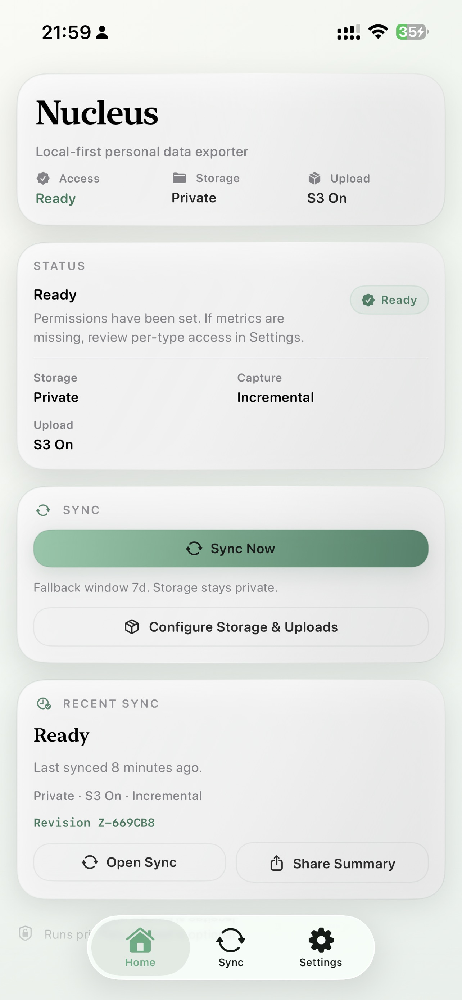
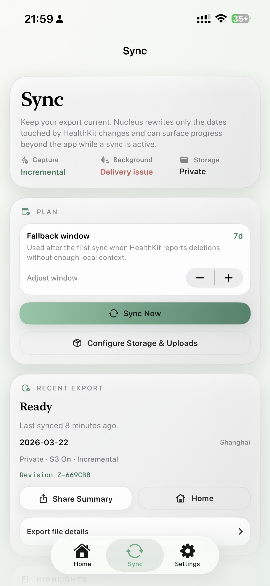
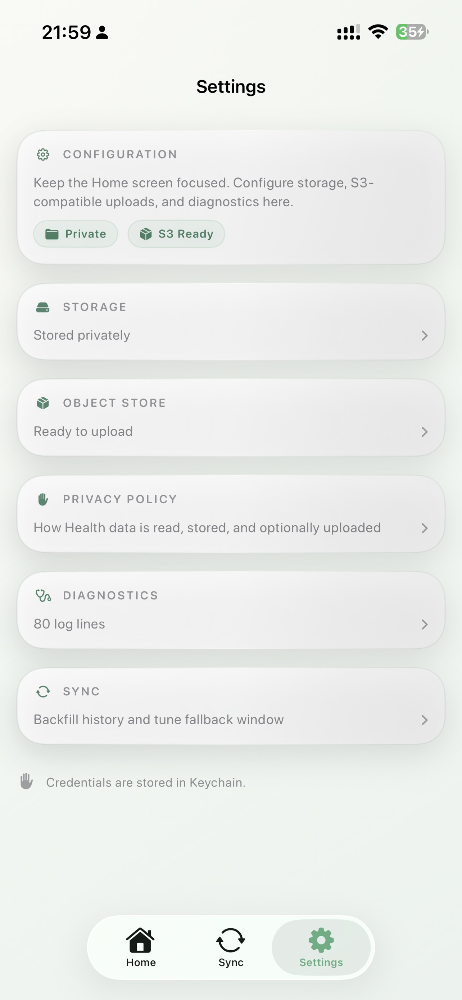
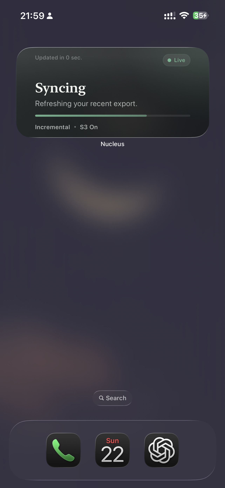

# Introducing Nucleus

Nucleus is a local-first personal data archive for people and agents.

It starts with Apple Health, but the larger idea is broader: personal data should be durable,
structured, private by default, and usable outside the app that first captured it.

This repository currently contains the MCP server, the export tooling, and the iOS app that make
that possible.

## Why this exists

Modern agent workflows are getting stronger very quickly.

Claude Code, Codex, OpenCode, and similar tools can reason over files, structured data, and local
workflows far better than they could even a year ago. But the data layer is still weak. Most
personal data is trapped inside apps, tied to cloud dashboards, or shaped for UI convenience
instead of long-term use.

That creates a bad default:

- the user does not really own the data workflow
- the files are not durable
- the structure is hard to inspect
- agents cannot reliably use the data without brittle glue

Nucleus is an attempt to fix that.

## The first release

The first release focuses on Apple Health.

With the user's permission, Nucleus reads HealthKit data and builds stable exports that stay
private by default. It does not require an account. It does not try to become another hosted sync
product.

Today, that includes:

- daily Health exports with predictable structure
- raw sample history
- incremental background refresh
- Home screen widgets and Live Activity status surfaces
- optional uploads to a user-owned S3-compatible bucket
- an MCP and CLI layer that can query the exported data

<p align="center">
  
  
  
</p>

## The interfaces in this repository

This repo is not only the iOS collector.

It currently exposes Nucleus through several different surfaces:

- the iOS app that collects and exports Apple Health data
- the `nucleus-apple` CLI
- the MCP server (`nucleus-apple-mcp`)
- OpenClaw-ready skills under `skills/`

The CLI and MCP server share the same tool surface. That matters because it makes the archive
useful in both shell workflows and agent workflows.

Example CLI entry points:

```bash
uvx --from nucleus-apple-mcp nucleus-apple health read-daily-metrics --date 2026-03-14 --pretty
uvx --from nucleus-apple-mcp nucleus-apple health analyze-range --start-date 2026-03-01 --end-date 2026-03-14 --pretty
uvx --from nucleus-apple-mcp nucleus-apple health list-changes --limit 20 --pretty
uvx nucleus-apple-mcp
```

The repository also includes reusable skills for:

- `nucleus-apple-health`
- `nucleus-apple-notes`
- `nucleus-apple-reminders`
- `nucleus-apple-calendar`

That is an important part of the design. Nucleus is not just storing files. It is exposing a
structured interface that other tools can compose with.

For the current health export layout, see [docs/specs/health.md](specs/health.md). For reusable
agent integrations, see [`skills/`](../skills/).

## Built for people and agents

Nucleus is not just a utility for exporting files.

It is designed to produce a data layer that both people and agents can work with. The files are
meant to be durable enough for archival use and structured enough for tool use.

That matters because the most interesting workflows are no longer limited to a single app:

- a person may want a private archive they can inspect directly
- a script may want predictable JSON or JSONL files
- an MCP client may want range summaries, raw sample inspection, or commit history
- an agent may want to reason over the archive as part of a larger task

The goal is not to optimize for one model vendor. Claude Code and Codex are obvious examples today,
but the archive should remain useful even if the surrounding tooling changes.

## Agent workflows to try

The most convincing uses of Nucleus are not isolated queries. They are cross-domain workflows that
combine schedule, health context, and working notes into something directly useful.

Here are a few examples that fit the current product well.

Under the hood, these workflows are built from a few reusable pieces:

- `nucleus-apple-calendar` for upcoming events and time windows
- `nucleus-apple-health` for daily metrics, trends, and export history
- `nucleus-apple-notes` for project notes, prep material, and freeform context
- `nucleus-apple-reminders` for follow-ups and concrete next actions

That matters because the interesting part is not a single query. It is the composition.

### Morning brief

Prompt:

`Use my calendar, last night's sleep, and my recent notes to draft a realistic plan for today.`

Why it works:

- combines Calendar, Health, and Notes in one pass
- produces a useful output instead of a raw summary
- treats Health as planning context, not diagnosis

### Recovery-aware day planning

Prompt:

`If my recovery looks poor today, which meetings should stay fixed, which tasks can move, and what kind of work fits better this afternoon?`

Why it works:

- turns Health trends into planning signal
- keeps the output practical and low drama
- shows why agent reasoning needs more than a single app view

### Meeting prep from context

Prompt:

`Prepare me for my 3 PM meeting using the calendar event, related notes, and my current energy context. Keep it brief and action-oriented.`

Why it works:

- very easy to understand as a real-world assistant behavior
- ties scheduled work to the notes that matter
- can fold in Health context without overclaiming

### Follow-up planner

Prompt:

`After my last two meetings today, look at the meeting notes, create a short follow-up list, and suggest which reminders should happen today versus later this week based on the rest of my calendar and current energy context.`

Why it works:

- connects Calendar, Notes, Reminders, and Health in one workflow
- turns captured context into a concrete next-action list
- shows that Nucleus can support execution, not just reflection

### Weekly review

Prompt:

`Summarize my week across calendar activity, sleep and recovery patterns, and project notes. End with a short next-week adjustment plan.`

Why it works:

- shows the archive value over time, not just in a single day
- makes the MCP and file model feel more durable
- produces something a user may actually keep

### Archive query

Prompt:

`Looking at the last three months, when did I sleep best, and what patterns show up in my schedule and notes during those periods?`

Why it works:

- demonstrates long-horizon reasoning over personal data
- is broader than “health coaching”
- makes the archive feel like infrastructure, not a one-off export

In all of these cases, the important point is the same: Nucleus is not trying to replace judgment
with automated medical advice. It is trying to make private personal data legible enough that both
people and agents can work with it.

## What Nucleus is not

Nucleus is not an AI health coach.

It is not trying to interpret your body for you, generate a wellness personality, or replace
medical judgment.

It is also not trying to hide your data behind an account-based sync service. The default posture is
private and local-first. If you want off-device access, you can explicitly connect your own
S3-compatible storage.

We also removed iCloud as a shipping path for Health data. Apple App Review does not allow apps to
sync personal health information to iCloud, so that path was removed from the product instead of
treated as a core feature.

## Configuration and object storage

The collector keeps its local state private by default, but the MCP read path is designed around an
S3-compatible object store.

The preferred config file is:

`~/.config/nucleus-apple-mcp/config.toml`

A minimal Health configuration looks like this:

```toml
[health]
storage_backend = "s3_object_store"

[health.s3]
endpoint = "https://<accountid>.r2.cloudflarestorage.com"
region = "auto"
bucket = "your-bucket"
prefix = "nucleus"
access_key_id = "..."
secret_access_key = "..."
use_path_style = true
```

Environment variables are also supported:

- `NUCLEUS_HEALTH_S3_ENDPOINT`
- `NUCLEUS_HEALTH_S3_REGION`
- `NUCLEUS_HEALTH_S3_BUCKET`
- `NUCLEUS_HEALTH_S3_PREFIX`
- `NUCLEUS_HEALTH_S3_ACCESS_KEY_ID`
- `NUCLEUS_HEALTH_S3_SECRET_ACCESS_KEY`
- `NUCLEUS_HEALTH_S3_SESSION_TOKEN`
- `NUCLEUS_HEALTH_S3_USE_PATH_STYLE`

For most people, Cloudflare R2 is a practical starting point. It is S3-compatible, straightforward
to configure, and fits the current Nucleus model well. The default R2 endpoint shape is
`https://<ACCOUNT_ID>.r2.cloudflarestorage.com`, and the S3 API region is `auto`.

Cloudflare's current R2 docs for S3 compatibility and token setup are here:

- https://developers.cloudflare.com/r2/api/s3/api/
- https://developers.cloudflare.com/r2/api/tokens/

If you use R2, the current recommendation is simple:

- create a dedicated bucket for Nucleus exports
- keep a stable prefix such as `nucleus/`
- use S3 API credentials scoped to that bucket
- start with `region = "auto"` and `use_path_style = true`

This is not a requirement. Any S3-compatible store that works with SigV4 should fit the same
layout.

## Why open source matters here

This project is easier to trust if the architecture is visible.

The repo shows the moving parts directly:

- the Python MCP server
- the Swift sidecar and native Apple integrations
- the iOS app
- the Health export model and file layout
- the CLI and skill surface used by agent workflows

Open sourcing the project also makes the product claim more concrete. If Nucleus says it is
building a durable data layer for people and agents, the repository should make that legible.

## Where this can go

Apple Health is only the starting point.

The longer-term direction is a broader personal data archive that can include more domains while
keeping the same principles:

- local-first
- private by default
- no account required
- structured exports
- durable files
- useful to both people and agents

That is the real scope of Nucleus.

The current release is intentionally narrower. Start with one domain, make the export layer solid,
make the UX quiet, and make the output useful enough that it can leave the app without losing its
meaning.

<p align="center">
  
</p>
